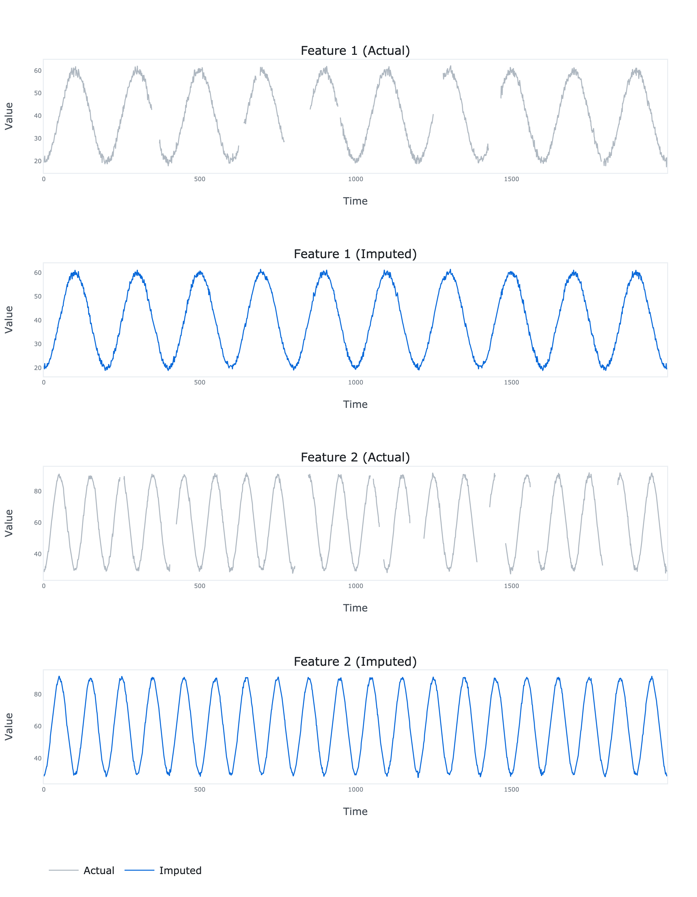

# BRITS TensorFlow


TensorFlow implementation of multivariate time series imputation model introduced in Cao, W., Wang, D., Li, J.,
Zhou, H., Li, L. and Li, Y., 2018. BRITS: Bidirectional recurrent imputation for time series.
*Advances in neural information processing systems*, 31.


*Model architecture (source: [NEURIPS 2018](https://proceedings.neurips.cc/paper_files/paper/2018/file/734e6bfcd358e25ac1db0a4241b95651-Paper.pdf))*

## Dependencies
```bash
pandas==1.5.2
numpy==1.23.5
tensorflow==2.11.0
plotly==5.11.0
kaleido==0.2.1
```
## Usage
```python
import numpy as np

from brits_tensorflow.model import BRITS
from brits_tensorflow.plots import plot

# Generate some time series
N = 2000
t = np.linspace(0, 1, N)
e = np.random.multivariate_normal(mean=np.zeros(2), cov=np.eye(2), size=N)
a = 40 + 20 * np.cos(2 * np.pi * (10 * t - 0.5)) + e[:, 0]
b = 60 + 30 * np.cos(2 * np.pi * (20 * t - 0.5)) + e[:, 1]
x = np.hstack([a.reshape(- 1, 1), b.reshape(- 1, 1)])

# Add some missing values
for i in range(10):
    a = np.random.randint(low=200, high=N - 200, size=2)
    b = np.random.randint(low=5, high=50, size=2)
    for j in range(2):
        x[a[j]: a[j] + b[j], j] = np.nan
    
# Fit the model
model = BRITS(
    x=x,
    units=100,
    timesteps=200
)

model.fit(
    learning_rate=0.001,
    batch_size=16,
    epochs=200,
    verbose=True
)

# Impute the missing values
x_hat = model.impute(x=x)

# Plot the imputations
fig = plot(actual=x, imputed=x_hat)
fig.write_image('results.png', scale=4, height=900, width=700)

```

